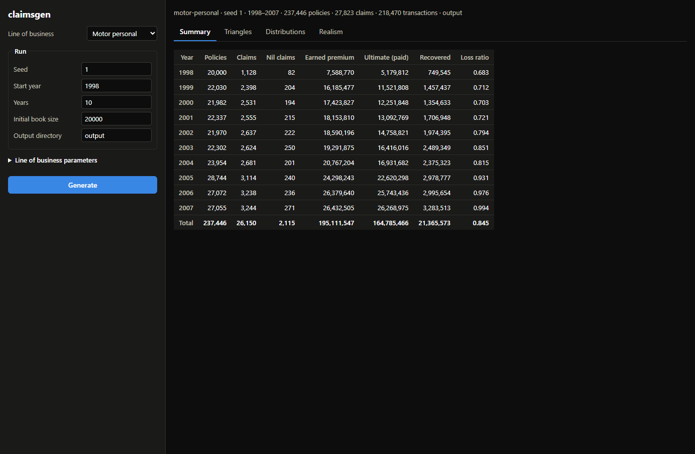
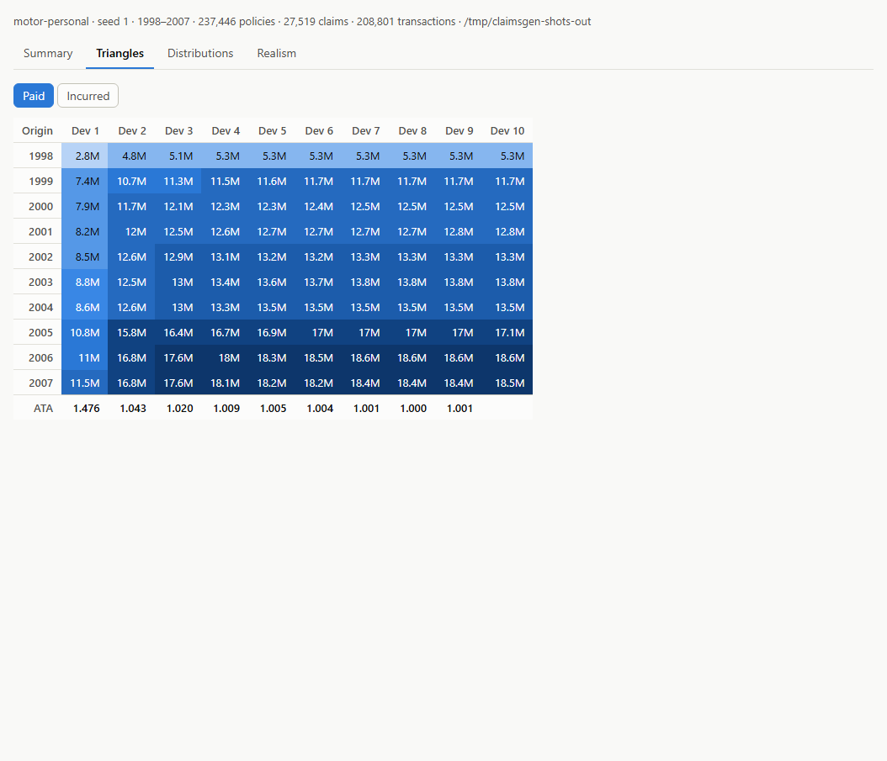
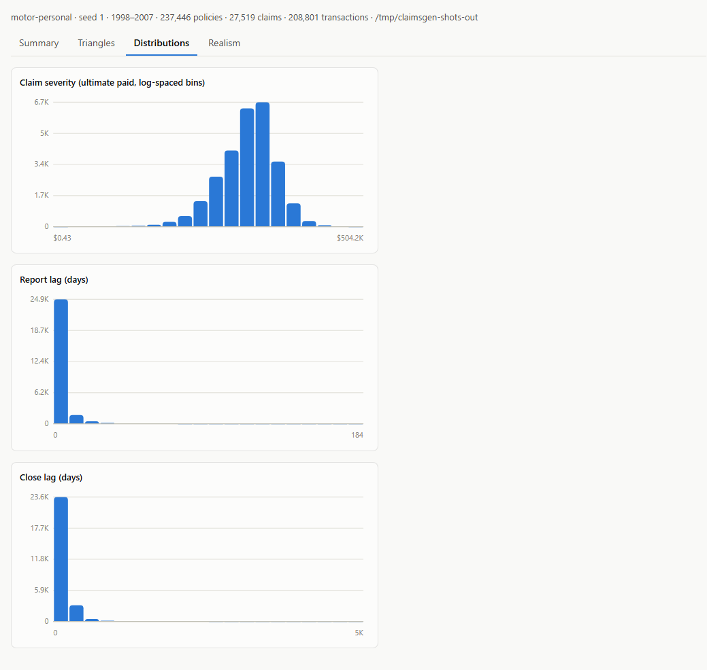
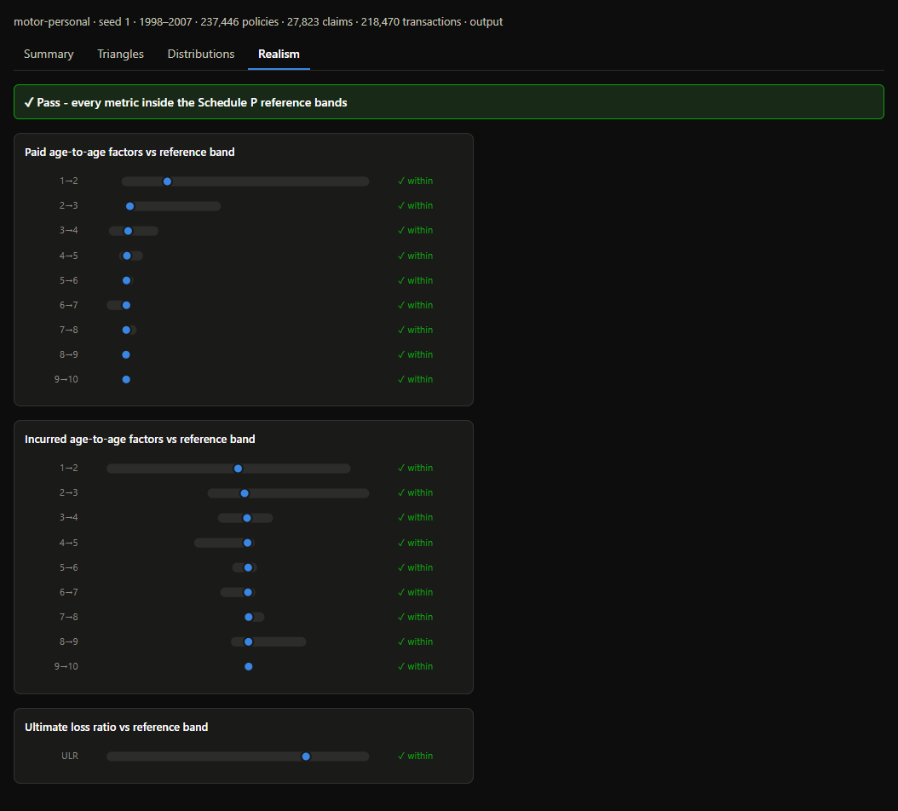
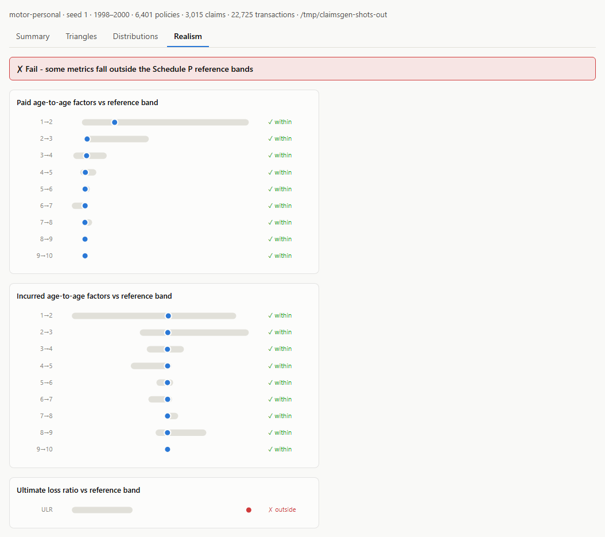

# claimsgen

A local CLI app that generates realistic, fully synthetic insurance claims data as dummy input to reserving processes. Nothing in the output is real, so there are no data governance concerns.

One run produces three linked CSV datasets for a class of business:

- **policies.csv** - the book of policies per calendar year: cover dates, sum insured, excess, risk factor, premium
- **claims.csv** - claim events with occurrence, report and close dates plus the initial case estimate
- **transactions.csv** - each claim's case estimate movements and payments over its lifetime

## Quickstart

```
go build ./cmd/claimsgen
./claimsgen generate
```

That generates a personal motor book (10 calendar years from 1998, 20,000 policies in year one) into `./output/` using the embedded preset. Options:

```
claimsgen generate \
  --config my-lob.yaml \      # line of business parameters (default: embedded motor-personal preset)
  --seed 42 \                 # master random seed (same seed + config = byte-identical output)
  --out ./output \            # output directory
  --start-year 1998 \         # first calendar year of the book
  --years 10 \                # number of calendar years
  --initial-book-size 20000   # policies written in the first year
```

## Browser UI

```
./claimsgen ui
```

Serves a local web UI on `http://127.0.0.1:8080` (`--port` to change). It offers the same run flags as the CLI plus every line of business parameter (prefilled from the preset, editable), writes the same three CSVs on Generate, and shows the result: per-year summary stats, paid and incurred development triangles with age-to-age factors, severity and lag distributions, and the run's position inside the Schedule P realism bands. The Schedule P reference data is embedded in the binary.

Configure a run in the sidebar and hit Generate - the summary tab shows per-year stats for the book:



| Development triangles | Distributions |
| --- | --- |
| Paid and incurred cumulative triangles as heatmaps, with volume-weighted age-to-age factors underneath. | Claim severity (log-spaced bins) plus report and close lag histograms. |
|  |  |

| Realism check | Realism check - failing run |
| --- | --- |
| Every metric of the default preset falls inside the bands observed across the Schedule P reference companies. | Cranking base frequency to 0.5 pushes the ultimate loss ratio outside its band. |
|  |  |

## How the simulation works

1. **Policy book** - each year's book size is the previous year's size times a growth factor times random noise, so the book trends upward but can shrink in individual years. Per policy: sum insured (lognormal with calendar-year inflation), a mean-1 risk factor loading claim frequency, an excess from a discrete choice set, and premium proportional to sum insured and risk.
2. **Claim events** - Poisson claim counts per policy scaled by the risk factor; short lognormal report lags; ground-up losses mixing own damage (lognormal, scaled by sum insured) and third party liability (Pareto, not capped at sum insured), then scaled by a claims-inflation index at the claim's occurrence year; losses below the excess are not reportable. Close delays are gamma distributed, stretched for large claims and risky policyholders. A share of reported claims are nil - they close without any payment.
3. **Case estimate runoff** - each claim's true ultimate cost is drawn around the initial estimate, payments split it over the claim's life, and the case estimate is a noisy view of the remaining cost that settles as the claim ages. A nil claim instead carries its case estimate through revisions and releases it to zero at close, paying nothing.
4. **Transactions** - the first row of every claim is its initial case estimate on the report date, so the outstanding case at any time is the running sum of `ESTIMATE` amounts. Every payment carries a matching case reduction. At close the outstanding case is exactly zero and total paid equals the ultimate (zero for a nil claim).

Claims inflation is a stochastic path: each calendar year's factor is a mean level (a per-line-of-business knob) times lognormal noise, compounding from the start year and drawn from its own labelled sub-stream so it stays reproducible and independent of the other stages.

There is no valuation date: every claim runs to closure, which supports out-of-sample testing of reserving methods.

## Parameters per line of business

All behavior is driven by a YAML file mapped to the `LineOfBusiness` domain object - see `internal/infrastructure/config/motor-personal.yaml` for the annotated motor preset. New short-tail classes are added by writing a new YAML file, no code changes.

## Realism

Generated data is checked against the ~145 Schedule P private passenger auto reference datasets (1998-2007) in `data/reference/ppauto_pos98-07/`: paid and incurred age-to-age development factors and the ultimate loss ratio must fall inside the bands observed across the reference companies. This runs as a test gate (`TestDefaultPresetIsRealistic`).

## Development

```
go test ./...
go vet ./...
```

The layout is domain-driven: `internal/domain/` holds the simulation model (policy, claim, transaction, lob, triangle) with no outside dependencies, `internal/application/` the use cases, and `internal/infrastructure/` the adapters (config, CSV, Schedule P reader, gonum-backed randomness). Design docs live in `docs/`.
