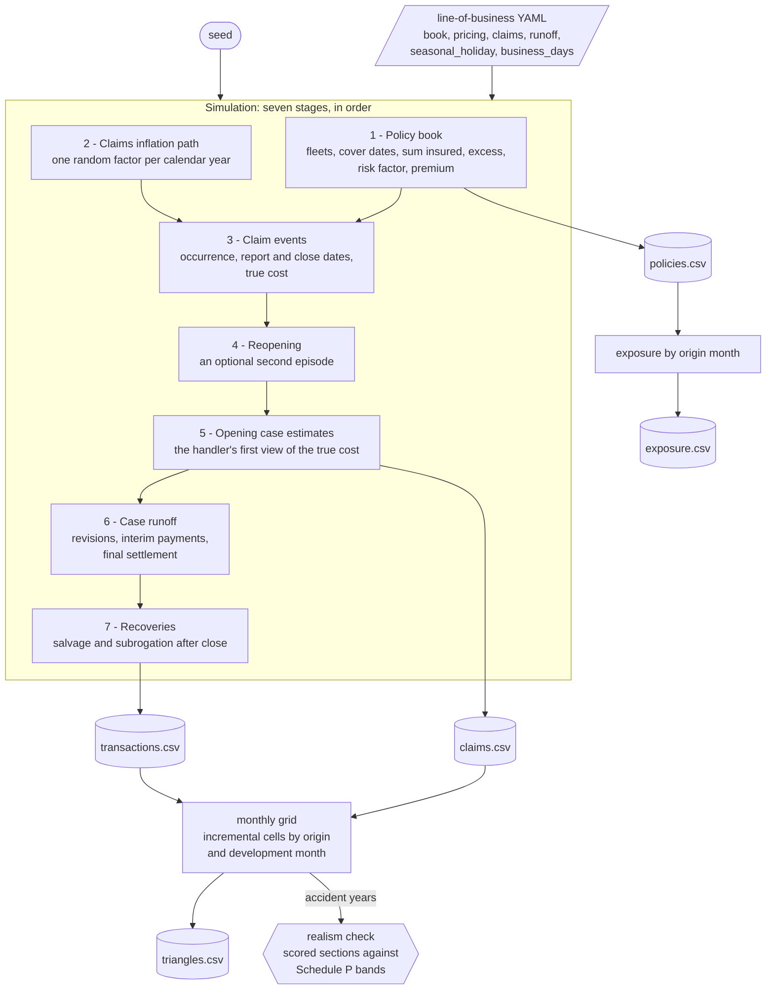
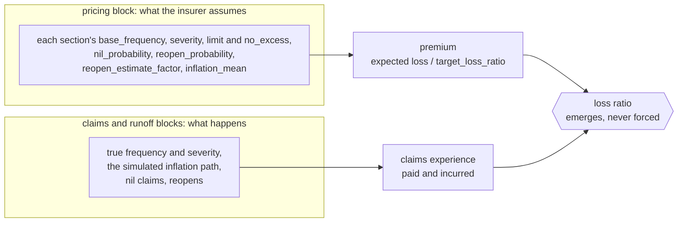
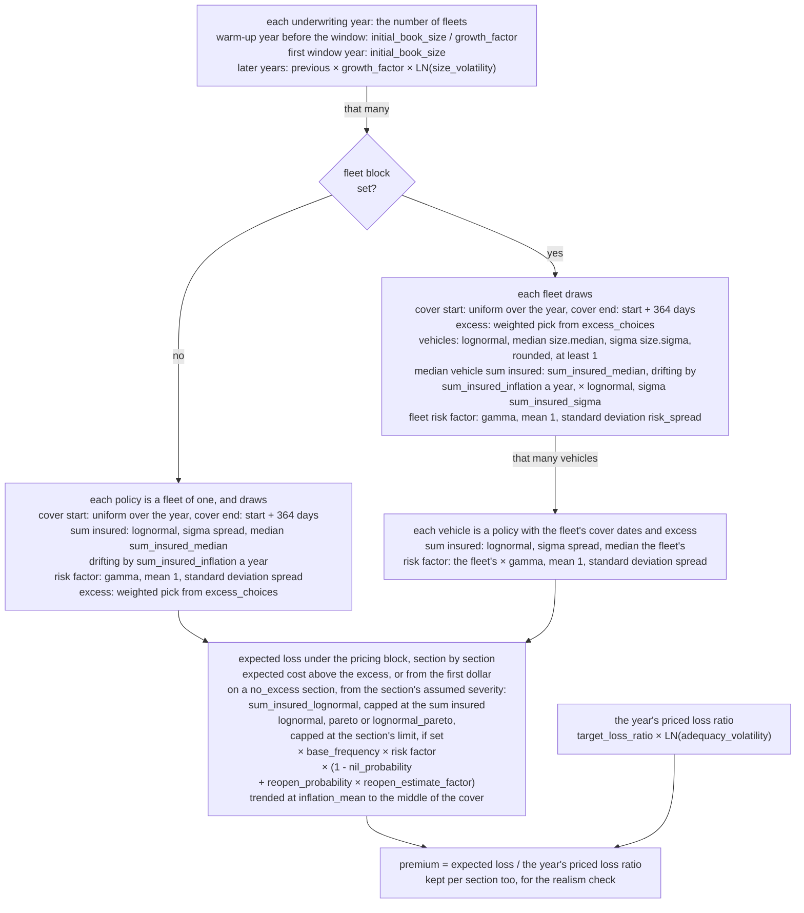
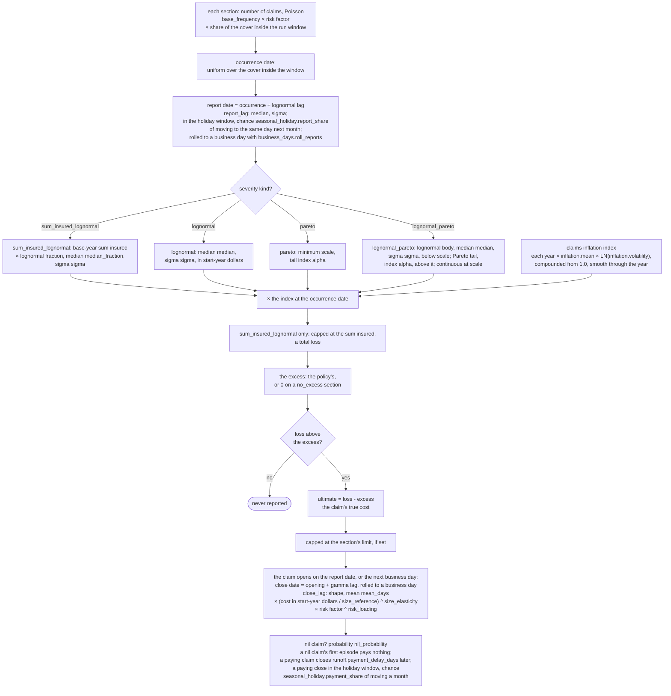
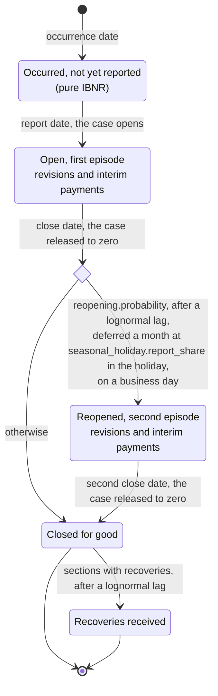
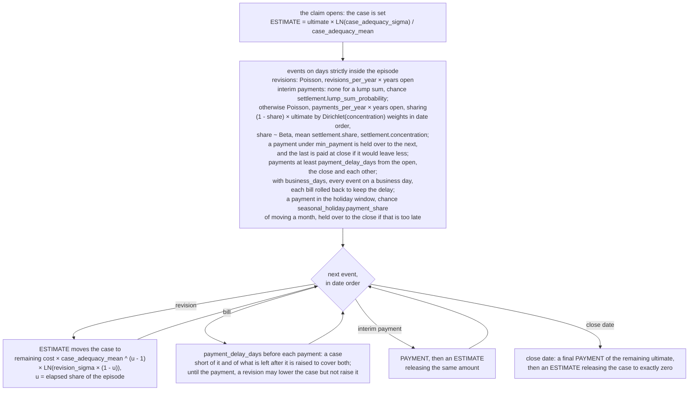
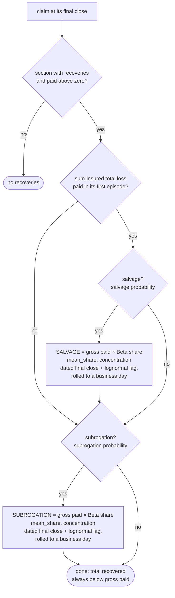
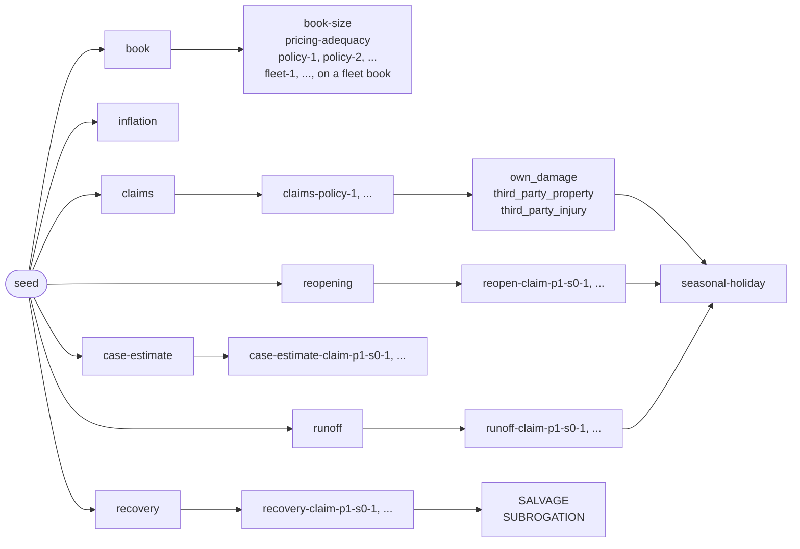
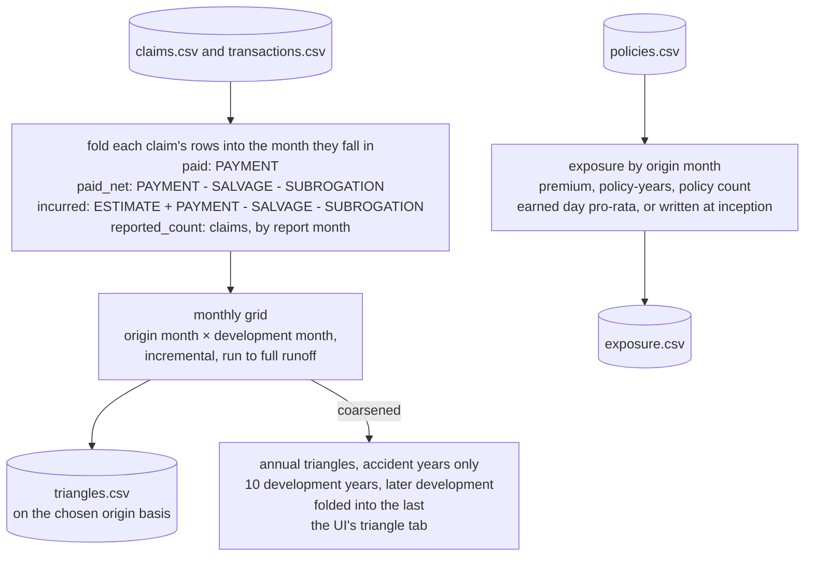
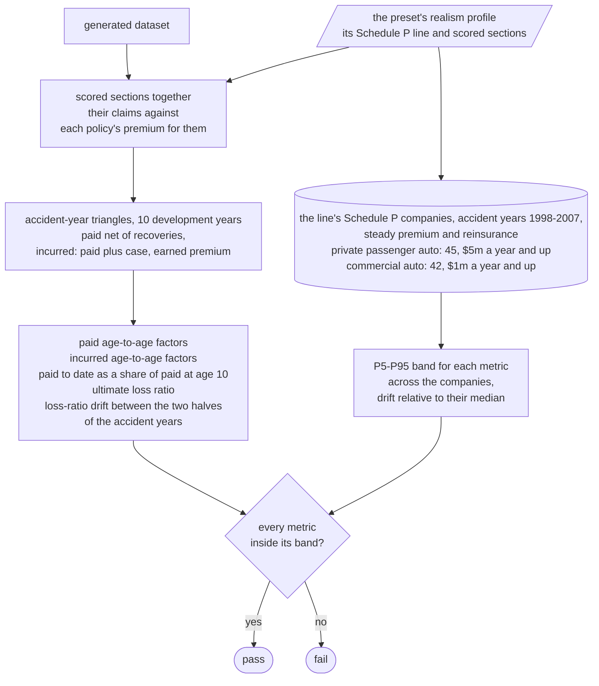

# claimsgen

A local CLI app that generates realistic, fully synthetic insurance claims data as dummy input to reserving processes. Nothing in the output is real, so there are no data governance concerns.

One run produces five linked CSV datasets for a class of business:

- **policies.csv** - the book of policies per calendar year: fleet, cover dates, sum insured, excess, risk factor, premium. On a fleet book each policy is one vehicle on a fleet. It includes a warm-up underwriting year before the window, whose policies are in force when it opens
- **claims.csv** - claim events with occurrence, report and close dates plus the initial case estimate
- **transactions.csv** - each claim's case estimate movements, payments, and recoveries (salvage and subrogation) over its lifetime
- **triangles.csv** - incremental monthly development triangles by origin month: paid, paid net of recoveries, incurred, and reported claim counts
- **exposure.csv** - exposure by origin month: premium, exposure units in policy-years (vehicle-years on a fleet book), and a policy count that is an in-force count on the accident basis (so it does not sum to the book's policy count) and an inception count on the underwriting basis (so it does, apart from the warm-up year, which incepts before the window)

With `--section-detail`, `generate` also writes two files that break the run down by section of cover (the browser UI and its zip stay at five files):

- **claim_sections.csv** - one row per claim, in `claims.csv` order: `claim_id,section`, where `section` is the section's `name` in the line of business (for the presets `own_damage`, `third_party_property` and `third_party_injury`)
- **exposure_sections.csv** - one row per origin month and section: `origin_month,section,premium`, origin months in `exposure.csv` order and sections in the line of business's order. `premium` is the month's premium for that section on the run's origin basis, aggregated as `exposure.csv`'s premium is but from each policy's premium for the section. A policy's sections are each rounded to the cent, so for a month they add up to `exposure.csv`'s premium to within about a cent per policy in force, not exactly

## Quickstart

```
go build ./cmd/claimsgen
./claimsgen generate
```

That generates a personal motor book (10 calendar years from 1998, 20,000 policies in year one) into `./output/` using the embedded `motor-personal` preset. Two presets are embedded: `motor-personal`, a personal motor book, and `motor-commercial`, a commercial motor book of fleets. Options:

```
claimsgen generate \
  --preset motor-commercial \ # embedded line of business (default motor-personal)
  --config my-lob.yaml \      # or a line of business YAML instead of a preset
  --seed 42 \                 # master random seed (same seed + config = byte-identical output)
  --out ./output \            # output directory
  --start-year 1998 \         # first calendar year of the book
  --years 10 \                # number of calendar years
  --initial-book-size 20000 \ # policies written in the first year, or fleets on a fleet book
  --origin-basis accident \   # monthly origin: accident or underwriting
  --section-detail            # also write claim_sections.csv and exposure_sections.csv
```

## Browser UI

```
./claimsgen ui
```

Serves a local web UI on `http://127.0.0.1:8080` (`--port` to change). It offers the same run flags as the CLI apart from the output directory (including an origin basis select for `--origin-basis`) plus every line of business parameter (prefilled from the preset, editable, with a group per section of cover, a Pricing group holding the insurer's assumed loss cost and target loss ratio, a Recoveries group for the salvage and subrogation probabilities, mean shares, and lags, and a reopen probability and reopen estimate factor for reopened claims), and on Generate shows the result: per-year summary stats (including a Recovered column and a Reopened column), paid and incurred development triangles with age-to-age factors and a Paid (gross) / Paid (net) / Incurred toggle, severity and lag distributions, and the run's position inside the realism bands of the preset's Schedule P line. Download CSVs saves the run's five CSVs, byte-identical to the CLI's, as one zip: the server keeps nothing between requests and regenerates the run from its seed and parameters. The Schedule P reference data is embedded in the binary.

A run reports its elapsed time and can be cancelled while it is going; the previous run's results stay on screen, dimmed and labelled, until the new ones arrive. The UI caps run size - years, initial book size, and the projected policy count once the growth factor has compounded - so a mistyped parameter is rejected rather than run. The CLI has no such caps.

Configure a run in the sidebar and hit Generate - the summary tab shows per-year stats for the book:


| Development triangles | Distributions |
| --- | --- |
| Cumulative triangles as heatmaps - paid gross, paid net of recoveries, or incurred - with volume-weighted age-to-age factors underneath. | Claim severity (log-spaced bins) plus report and close lag histograms. |
|  |  |

| Realism check | Realism check - failing run |
| --- | --- |
| Every metric of the default preset falls inside the bands observed across the Schedule P reference companies. | Raising the third-party injury base frequency to 0.1 pushes the ultimate loss ratio and the early paid factors outside their bands. |
|  |  |

## How the simulation works

A run is a pipeline of seven stages over one line of business. Each stage reads its block of the line-of-business YAML and draws from its own labelled random sub-stream. The claim and reopening stages fix every claim's true cost before any case estimate or payment is drawn, so the later stages decide how that cost is reserved and when it is paid, never its gross amount.

The diagrams in this section are the model documentation. They show each stage's random draws and the parameters behind them, named by their YAML key within their block: a section's `close_lag.mean_days` appears as `mean_days`, and `internal/infrastructure/config/motor-personal.yaml` annotates the preset's values. `LN(x)` is mean-one lognormal noise with sigma `x`: it scatters a value around itself without moving its average, and a sigma of 0 switches it off.


```mermaid
%%{init: {"flowchart": {"wrappingWidth": 480}}}%%
flowchart TD
    yaml[/"line-of-business YAML<br/>book, pricing, claims, runoff,<br/>seasonal_holiday, business_days"/]
    seed(["seed"])
    subgraph sim["Simulation: seven stages, in order"]
        s1["1 - Policy book<br/>fleets, cover dates, sum insured, excess,<br/>risk factor, premium"]
        s2["2 - Claims inflation path<br/>one random factor per calendar year"]
        s3["3 - Claim events<br/>occurrence, report and close dates,<br/>true cost"]
        s4["4 - Reopening<br/>an optional second episode"]
        s5["5 - Opening case estimates<br/>the handler's first view of the true cost"]
        s6["6 - Case runoff<br/>revisions, interim payments,<br/>final settlement"]
        s7["7 - Recoveries<br/>salvage and subrogation after close"]
        s1 --> s3
        s2 --> s3
        s3 --> s4 --> s5 --> s6 --> s7
    end
    policiesCsv[("policies.csv")]
    claimsCsv[("claims.csv")]
    transactionsCsv[("transactions.csv")]
    grid["monthly grid<br/>incremental cells by origin<br/>and development month"]
    exposure["exposure by origin month"]
    trianglesCsv[("triangles.csv")]
    exposureCsv[("exposure.csv")]
    realism{{"realism check<br/>scored sections against<br/>Schedule P bands"}}
    yaml --> sim
    seed --> sim
    s1 --> policiesCsv
    s5 --> claimsCsv
    s7 --> transactionsCsv
    claimsCsv & transactionsCsv --> grid
    policiesCsv --> exposure
    grid --> trianglesCsv
    exposure --> exposureCsv
    grid -- "accident years" --> realism
```

### Policy book and premium

Premium and claims come from two separate models. The `pricing` block is what the insurer assumes about its claims, and it sets premium; the `claims` and `runoff` blocks are what actually happens. The loss ratio is whatever the two produce.


```mermaid
%%{init: {"flowchart": {"wrappingWidth": 480}}}%%
flowchart LR
    subgraph assumed["pricing block: what the insurer assumes"]
        assumptions["each section's base_frequency, severity, limit and no_excess,<br/>nil_probability, reopen_probability,<br/>reopen_estimate_factor, inflation_mean"]
    end
    subgraph actual["claims and runoff blocks: what happens"]
        truth["true frequency and severity,<br/>the simulated inflation path,<br/>nil claims, reopens"]
    end
    premium["premium<br/>expected loss / target_loss_ratio"]
    experience["claims experience<br/>paid and incurred"]
    lossRatio{{"loss ratio<br/>emerges, never forced"}}
    assumptions --> premium
    truth --> experience
    premium --> lossRatio
    experience --> lossRatio
```

The book is written one underwriting year at a time, and every policy is priced from the pricing block alone:


```mermaid
%%{init: {"flowchart": {"wrappingWidth": 480}}}%%
flowchart TD
    size["each underwriting year: the number of fleets<br/>warm-up year before the window: initial_book_size / growth_factor<br/>first window year: initial_book_size<br/>later years: previous × growth_factor × LN(size_volatility)"]
    priced["the year's priced loss ratio<br/>target_loss_ratio × LN(adequacy_volatility)"]
    fleetSet{"fleet block<br/>set?"}
    draws["each policy is a fleet of one, and draws<br/>cover start: uniform over the year, cover end: start + 364 days<br/>sum insured: lognormal, sigma spread, median sum_insured_median<br/>drifting by sum_insured_inflation a year<br/>risk factor: gamma, mean 1, standard deviation spread<br/>excess: weighted pick from excess_choices"]
    fleet["each fleet draws<br/>cover start: uniform over the year, cover end: start + 364 days<br/>excess: weighted pick from excess_choices<br/>vehicles: lognormal, median size.median, sigma size.sigma,<br/>rounded, at least 1<br/>median vehicle sum insured: sum_insured_median, drifting by<br/>sum_insured_inflation a year, × lognormal, sigma sum_insured_sigma<br/>fleet risk factor: gamma, mean 1, standard deviation risk_spread"]
    vehicle["each vehicle is a policy with the fleet's cover dates and excess<br/>sum insured: lognormal, sigma spread, median the fleet's<br/>risk factor: the fleet's × gamma, mean 1, standard deviation spread"]
    expected["expected loss under the pricing block, section by section<br/>expected cost above the excess, or from the first dollar<br/>on a no_excess section, from the section's assumed severity:<br/>sum_insured_lognormal, capped at the sum insured<br/>lognormal, pareto or lognormal_pareto,<br/>capped at the section's limit, if set<br/>× base_frequency × risk factor<br/>× (1 - nil_probability<br/>+ reopen_probability × reopen_estimate_factor)<br/>trended at inflation_mean to the middle of the cover"]
    premium["premium = expected loss / the year's priced loss ratio<br/>kept per section too, for the realism check"]
    size -- "that many" --> fleetSet
    fleetSet -- "no" --> draws --> expected
    fleetSet -- "yes" --> fleet -- "that many vehicles" --> vehicle --> expected
    expected --> premium
    priced --> premium
```

Each year's book size is the previous year's size times a growth factor times random noise, so the book trends upward but can shrink in individual years. The size counts fleets: without a `fleet` block (the personal preset) each fleet is one policy, and with one (the commercial preset) a fleet is one contract, written first, and each of its vehicles is then a policy drawn around the fleet's values. A fleet sets the level of its vehicles' sums insured and risk, and `spread` is what is left between the vehicles of one fleet; the fleet risk factor makes its vehicles' claim frequencies move together. The book starts with a warm-up underwriting year before the window, so the first accident year has a full book in force instead of one ramping up from nothing; only its claims that occur inside the window are kept. Premium is the insurer's assumed loss cost divided by `target_loss_ratio`, independent of the claims model that generates experience. `adequacy_volatility` makes each underwriting year's rates miss the target by a random factor, as in an underwriting cycle. The target sets premium, not experience: the realized loss ratio lands around the target rather than on it, moved by claim sampling, the simulated inflation path, and any gap between the pricing and claims assumptions.

### Claim events

Each section of each policy produces its claims independently, from its own block of `claims.sections`. Both presets have three sections: `own_damage`, the insured vehicle, `third_party_property`, damage to other people's vehicles and property, and `third_party_injury`, bodily injury to others. The severity draw below fixes the claim's true ultimate cost; no later stage changes it, though a reopen adds a separate second amount.


```mermaid
%%{init: {"flowchart": {"wrappingWidth": 480}}}%%
flowchart TD
    count["each section: number of claims, Poisson<br/>base_frequency × risk factor<br/>× share of the cover inside the run window"]
    occurrence["occurrence date:<br/>uniform over the cover inside the window"]
    report["report date = occurrence + lognormal lag<br/>report_lag: median, sigma;<br/>in the holiday window, chance seasonal_holiday.report_share<br/>of moving to the same day next month;<br/>rolled to a business day with business_days.roll_reports"]
    kind{"severity kind?"}
    siLoss["sum_insured_lognormal: base-year sum insured<br/>× lognormal fraction, median median_fraction,<br/>sigma sigma"]
    lognormalLoss["lognormal: median median,<br/>sigma sigma, in start-year dollars"]
    paretoLoss["pareto: minimum scale,<br/>tail index alpha"]
    splicedLoss["lognormal_pareto: lognormal body, median median,<br/>sigma sigma, below scale; Pareto tail,<br/>index alpha, above it; continuous at scale"]
    index["claims inflation index<br/>each year × inflation.mean × LN(inflation.volatility),<br/>compounded from 1.0, smooth through the year"]
    trended["× the index at the occurrence date"]
    cap["sum_insured_lognormal only: capped at the sum insured,<br/>a total loss"]
    excess["the excess: the policy's,<br/>or 0 on a no_excess section"]
    pierce{"loss above<br/>the excess?"}
    dropped(["never reported"])
    ultimate["ultimate = loss - excess<br/>the claim's true cost"]
    limitCap["capped at the section's limit, if set"]
    closeDate["the claim opens on the report date, or the next business day;<br/>close date = opening + gamma lag, rolled to a business day<br/>close_lag: shape, mean mean_days<br/>× (cost in start-year dollars / size_reference) ^ size_elasticity<br/>× risk factor ^ risk_loading"]
    nilFlag["nil claim? probability nil_probability<br/>a nil claim's first episode pays nothing;<br/>a paying claim closes runoff.payment_delay_days later;<br/>a paying close in the holiday window, chance<br/>seasonal_holiday.payment_share of moving a month"]
    count --> occurrence --> report --> kind
    kind -- "sum_insured_lognormal" --> siLoss
    kind -- "lognormal" --> lognormalLoss
    kind -- "pareto" --> paretoLoss
    kind -- "lognormal_pareto" --> splicedLoss
    siLoss --> trended
    lognormalLoss --> trended
    paretoLoss --> trended
    splicedLoss --> trended
    index --> trended
    trended --> cap --> excess --> pierce
    pierce -- "no" --> dropped
    pierce -- "yes" --> ultimate --> limitCap --> closeDate --> nilFlag
```

Losses that do not exceed the excess are never reported, so the reported frequency sits below `base_frequency`. A section with `no_excess: true` takes no excess and pays every loss from the first dollar, as liability cover usually does: both presets' two liability sections, so third parties are paid in full. In the presets, report lags are short for own damage and property damage and longer for injury claims, so there are claims incurred but not yet reported to estimate. Own-damage and property-damage claims settle in weeks to months. Injury claims are rarer and heavy-tailed - a lognormal body of small claims under a Pareto tail (`lognormal_pareto`), whose share of claims keeps the density continuous where the tail starts - and settle in a slow long-tail regime calibrated to each preset's Schedule P liability reference, so paid losses keep developing at later ages; commercial injury settles more slowly than personal. Property damage is a lognormal in start-year dollars. Injury and property damage are capped at their per-claim limits (`limit`: $100,000 and $50,000 in the personal preset, $1m on both in the commercial preset, as a combined single limit would), which cover a claim's whole life, reopen included. A limit is nominal, a contract term that claims inflation does not trend, so inflation erodes it over the years; a claim settled at its limit settles like a claim of the limit's size. In every section, settlement time lengthens smoothly with claim size. A share of reported claims are nil - they close without any payment at their first close.

Claims inflation is a stochastic path: each calendar year's factor is a mean level (a per-line-of-business knob) times lognormal noise, compounding from the start year and drawn from its own labelled sub-stream so it stays reproducible and independent of the other stages. The index sits at each year's compounded value in the middle of the year and moves smoothly between years rather than stepping each 1 January.

### A claim's life

From occurrence to final close, with the optional reopen. A claim's dates, cost and any reopen are all drawn before its first transaction is written; the runoff then draws how the case and the payments get from report to close.


```mermaid
stateDiagram-v2
    state "Occurred, not yet reported<br/>(pure IBNR)" as Unreported
    state "Open, first episode<br/>revisions and interim payments" as FirstEpisode
    state reopens <<choice>>
    state "Reopened, second episode<br/>revisions and interim payments" as SecondEpisode
    state "Closed for good" as Settled
    state "Recoveries received" as Recovered
    [*] --> Unreported: occurrence date
    Unreported --> FirstEpisode: report date, the case opens
    FirstEpisode --> reopens: close date, the case released to zero
    reopens --> SecondEpisode: reopening.probability, after a lognormal lag,<br/>deferred a month at seasonal_holiday.report_share in the holiday,<br/>on a business day
    reopens --> Settled: otherwise
    SecondEpisode --> Settled: second close date, the case released to zero
    Settled --> Recovered: sections with recoveries, after a lognormal lag
    Settled --> [*]
    Recovered --> [*]
```

A closed claim can reopen once: the case is re-raised a lognormal lag (`lag_median_days`, `lag_sigma`) after the first close, a second episode develops and pays an additional amount, and the claim closes for good. The reopen's additional cost is `estimate_factor` times the claim's ultimate with `LN(estimate_sigma)` noise, capped at the cover the claim has left on own damage and on a section with a `limit` (a claim already paid up to its sum insured or its limit does not reopen), and the second close lag comes from the same close-lag regime as the first. A nil claim that reopens pays in its second episode. claims.csv shows the final close date; the reopen is visible in transactions as the case re-raised after a release to zero. Setting the reopen probability to 0 switches reopening off.

There is no valuation date: every claim runs to closure, which supports out-of-sample testing of reserving methods.

### Case estimates and payments

Each episode turns the claim's true cost into a ledger of `ESTIMATE` and `PAYMENT` rows:


```mermaid
%%{init: {"flowchart": {"wrappingWidth": 480}}}%%
flowchart TD
    opening["the claim opens: the case is set<br/>ESTIMATE = ultimate × LN(case_adequacy_sigma) / case_adequacy_mean"]
    events["events on days strictly inside the episode<br/>revisions: Poisson, revisions_per_year × years open<br/>interim payments: none for a lump sum, chance settlement.lump_sum_probability;<br/>otherwise Poisson, payments_per_year × years open, sharing<br/>(1 - share) × ultimate by Dirichlet(concentration) weights in date order,<br/>share ~ Beta, mean settlement.share, settlement.concentration;<br/>a payment under min_payment is held over to the next,<br/>and the last is paid at close if it would leave less;<br/>payments at least payment_delay_days from the open,<br/>the close and each other;<br/>with business_days, every event on a business day,<br/>each bill rolled back to keep the delay;<br/>a payment in the holiday window, chance seasonal_holiday.payment_share<br/>of moving a month, held over to the close if that is too late"]
    nextEvent{"next event,<br/>in date order"}
    revise["ESTIMATE moves the case to<br/>remaining cost × case_adequacy_mean ^ (u - 1)<br/>× LN(revision_sigma × (1 - u)),<br/>u = elapsed share of the episode"]
    pay["PAYMENT, then an ESTIMATE<br/>releasing the same amount"]
    bill["payment_delay_days before each payment: a case<br/>short of it and of what is left after it is raised to cover both;<br/>until the payment, a revision may lower the case but not raise it"]
    settle["close date: a final PAYMENT of the remaining ultimate,<br/>then an ESTIMATE releasing the case to exactly zero"]
    opening --> events --> nextEvent
    nextEvent -- "revision" --> revise --> nextEvent
    nextEvent -- "bill" --> bill --> nextEvent
    nextEvent -- "interim payment" --> pay --> nextEvent
    nextEvent -- "close date" --> settle
```

The claim opens at a case estimate drawn around its ultimate - `case_adequacy_mean` sets whether cases open deficient or redundant, which moves reserves and incurred development but never the loss cost - payments split the ultimate over the claim's life, and the case estimate is a noisy view of the remaining cost that settles as the claim ages. The opening bias decays over the claim's life rather than vanishing at the first revision, so incurred keeps developing in one direction - upward in both presets, whose cases open deficient - for incurred-based and IBNER methods to pick up. A nil episode draws revisions but no payments: its handler, who does not know it will pay nothing, revises the case around its current level, and the case is released to zero at close. A reopened claim's second episode opens at a reopen estimate drawn the same way as the opening case, and runs the same loop on the reopen's additional cost.

How a claim is paid follows its section's `settlement`. With chance `lump_sum_probability` a paying episode is paid in one settlement at close, and so is one that draws no interim payment. Otherwise the final settlement is a Beta-distributed share of the cost, with mean `share`, and the interim payments split the rest. In the presets about nine in ten own-damage claims and three in four property damage claims pay once; one paid in instalments ends on a small balance, about a quarter of its cost on average. Injury claims rarely pay once and usually end on their largest payment, a settlement of about 60% of the cost on average. An interim payment below `min_payment` is held over to the next, and the final settlement has the same floor: when the instalments would leave less than `min_payment` for close, the last one is paid with the settlement instead.

Every payment comes at least `payment_delay_days` after the last `ESTIMATE` that raised the case: the opening case at report, a reopen, a revision up, or the bill for the payment itself. A case short of a bill is raised that many days before the payment, and no revision in between raises it. Before an interim payment the case covers the payment and the handler's view of what is left after it, so a payment never clears the case of a claim still open. A paying claim and every reopen stay open that much longer, and payments come at least that far apart. The presets use 7 days, so no claim is paid within a week of being reported. With 0 there is no delay, and a payment above the case raises it on the day.

The ledger is a stream of events that every measure folds from. The first row of every claim is its initial case estimate on the day the claim opens - its report date, or with a business-day calendar the next business day - so the outstanding case at any time is the running sum of `ESTIMATE` amounts. Every payment carries a matching case reduction. At close the outstanding case is exactly zero and total paid equals the ultimate (zero for a nil claim that does not reopen), and no claim pays beyond its cover: the sum insured minus excess for own damage, the section's `limit` for a limited section. Gross paid is the sum of a claim's `PAYMENT` rows; net paid subtracts its `SALVAGE` and `SUBROGATION` rows; incurred is the outstanding case plus net paid.

An illustrative own-damage claim with an ultimate of 4000.00, an illustrative `case_adequacy_mean` of 0.90 and a drawn settlement share of 0.35. The amounts are made up, but they follow the rules above:

| Date | Type | Amount | Outstanding case | Gross paid | What happened |
| --- | --- | ---: | ---: | ---: | --- |
| 2001-03-14 | ESTIMATE | 4800.00 | 4800.00 | 0.00 | reported: 4000 × noise 1.08 / 0.90 |
| 2001-04-13 | ESTIMATE | -637.67 | 4162.33 | 0.00 | revision at u = 1/3: aims at 4000 × 0.90 ^ (-2/3), noise 0.97 |
| 2001-04-28 | PAYMENT | 2600.00 | 4162.33 | 2600.00 | interim payment: the whole 65% pool in one payment |
| 2001-04-28 | ESTIMATE | -2600.00 | 1562.33 | 2600.00 | the payment releases its own case |
| 2001-05-23 | ESTIMATE | -115.17 | 1447.16 | 2600.00 | revision at u = 0.78: aims at 1400 × 0.90 ^ (-0.22), noise 1.01 |
| 2001-06-12 | PAYMENT | 1400.00 | 1447.16 | 4000.00 | close: settles the remaining ultimate |
| 2001-06-12 | ESTIMATE | -1400.00 | 47.16 | 4000.00 | the payment releases its own case |
| 2001-06-12 | ESTIMATE | -47.16 | 0.00 | 4000.00 | the rest of the case is released to zero |
| 2001-12-09 | SUBROGATION | 3120.00 | 0.00 | 4000.00 | 180 days after close: net paid is now 880.00 |

Incurred ends each of those days at 4800.00, 4162.33, 4162.33, 4047.16 and 4000.00 - drifting down, because the case opened redundant - and falls to 880.00 when the subrogation arrives.

transactions.csv is emitted in claim-registration order, not date order: all of a claim's rows are written together, and because recovery rows can post-date a claim's close date, a later claim's rows can carry earlier dates. Sort by date yourself if your reserving tool expects a date-ordered ledger.

### Summer holiday

Claims handling slows over the summer holiday. The `seasonal_holiday` block takes a share of the reports and payments the simulation dates in the holiday window and moves each to the same day of the next month, on top of what that month already holds. The window is 15 July to 14 August for `hemisphere: northern` and 15 December to 14 January for `southern`; `none`, the default, switches it off.

- A report in the window moves with chance `report_share`. The close lag runs from the report, so the claim's whole timeline moves back with it. A reopen in the window moves the same way, and its episode with it, so fewer claims reopen during the holiday and more just after it.
- A payment in the window moves with chance `payment_share`: an interim payment, or a final settlement together with the close date it lands on. A nil claim's close pays nothing and stays. An interim payment moved past the claim's last day for one is paid with the final settlement instead.

A moved date always lands outside the window, so nothing moves twice, and no claim's cost changes. Both presets use the northern summer, with 30% of reports and reopens and 40% of payments moved, enough that the slowdown shows in single claim ledgers as well as monthly totals; these are judgement values, since Schedule P is annual and says nothing about months. Northern moves stay within the calendar year, so they show in the monthly triangles and leave the annual ones almost unchanged. Southern moves from late December cross the year end.

### Business days

Claims are processed on business days. With a `business_days.calendar`, every transaction and processing event - each case estimate, payment, close, reopen and recovery - falls on a business day of the market; a date that lands on a weekend or public holiday moves to the next business day. Occurrence dates never move.

- `calendar`: `none` (the default, off), `weekends` (Saturday and Sunday only), `us` (US federal holidays), `uk` (England and Wales bank holidays) or `za` (South African public holidays). Holidays come from each market's rules, with its weekend substitutes; one-off holidays, such as royal events or election days, and bank holidays moved in a particular year are not modelled.
- `roll_reports`: off, a report keeps the day it is made, and a claim reported at a weekend or on a holiday is opened, with its case, on the next business day; on, the report date itself moves to the next business day. `claims.csv` shows the report date; the claim's first transaction is on the day it opens.

The close lag runs from the day the claim opens. A payment's bill rolls back to the business day before, so every payment still comes at least `payment_delay_days` calendar days after the case was last raised. Interim payments and revisions roll before the hold-over rules apply, and a revision rolled onto the close is dropped. Rolling takes no random draws, so `none` reproduces the output without the block exactly. Both presets use `us`; the personal preset leaves reports on any day, as policyholders report motor claims at weekends, and the commercial preset rolls them, as fleets report through an office or broker. Weekend and holiday work lands on the next business day, so Mondays carry about two and a half days' processing.

### Recoveries


```mermaid
%%{init: {"flowchart": {"wrappingWidth": 480}}}%%
flowchart TD
    closed["claim at its final close"]
    eligible{"section with recoveries<br/>and paid above zero?"}
    noRecovery(["no recoveries"])
    totalLoss{"sum-insured total loss<br/>paid in its first episode?"}
    salvage{"salvage?<br/>salvage.probability"}
    salvageRow["SALVAGE = gross paid × Beta share<br/>mean_share, concentration<br/>dated final close + lognormal lag,<br/>rolled to a business day"]
    subrogation{"subrogation?<br/>subrogation.probability"}
    subrogationRow["SUBROGATION = gross paid × Beta share<br/>mean_share, concentration<br/>dated final close + lognormal lag,<br/>rolled to a business day"]
    done(["done: total recovered<br/>always below gross paid"])
    closed --> eligible
    eligible -- "no" --> noRecovery
    eligible -- "yes" --> totalLoss
    totalLoss -- "yes" --> salvage
    totalLoss -- "no" --> subrogation
    salvage -- "yes" --> salvageRow --> subrogation
    salvage -- "no" --> subrogation
    subrogation -- "yes" --> subrogationRow --> done
    subrogation -- "no" --> done
```

Claims in a section with `recoveries: true` - own damage, in the preset - can yield subrogation (the payout is recovered from an at-fault third party), and total losses on a sum-insured section, where the vehicle is written off at its sum insured less excess, can yield salvage (the wreck is sold; a liability claim settled at its limit leaves none). Each is a Beta-distributed share of the claim's gross paid, so salvage is sized off the vehicle's value, received a lognormal lag (`lag_median_days`, `lag_sigma`) after the final close date - subrogation typically much later than salvage. Recoveries are pure cash events: the case estimate stays gross, and a claim's total recovered is always below its gross paid. Recovery rows are the only transactions dated after a claim's final close. Setting a recovery type's probability to 0 switches it off.

### Reproducibility

Every independent decision is drawn from its own labelled sub-stream keyed by the seed and a label path. Each label hashes its parent's key, so a stream's draws depend only on the seed and its path, never on how much any other stream drew:


```mermaid
%%{init: {"flowchart": {"wrappingWidth": 480}}}%%
flowchart LR
    seed(["seed"])
    book["book"]
    bookStreams["book-size<br/>pricing-adequacy<br/>policy-1, policy-2, ...<br/>fleet-1, ..., on a fleet book"]
    inflation["inflation"]
    claims["claims"]
    claimStreams["claims-policy-1, ..."]
    sectionStreams["own_damage<br/>third_party_property<br/>third_party_injury"]
    holidayStreams["seasonal-holiday"]
    reopening["reopening"]
    reopenStreams["reopen-claim-p1-s0-1, ..."]
    caseEstimate["case-estimate"]
    caseStreams["case-estimate-claim-p1-s0-1, ..."]
    runoff["runoff"]
    runoffStreams["runoff-claim-p1-s0-1, ..."]
    recovery["recovery"]
    recoveryStreams["recovery-claim-p1-s0-1, ..."]
    recoveryKinds["SALVAGE<br/>SUBROGATION"]
    seed --> book --> bookStreams
    seed --> inflation
    seed --> claims --> claimStreams --> sectionStreams
    seed --> reopening --> reopenStreams
    seed --> caseEstimate --> caseStreams
    seed --> runoff --> runoffStreams
    sectionStreams & reopenStreams & runoffStreams --> holidayStreams
    seed --> recovery --> recoveryStreams --> recoveryKinds
```

The same seed and config therefore produce byte-identical output, and toggling a knob is invisible to unrelated draws: changing one section, or turning nil claims, reopening, salvage, subrogation, the summer holiday or business days on or off, never reshuffles the draws of any other claim or stage. Each claim's later streams are labelled by its policy, section and place among that section's losses on the policy (`p<policy>-s<section>-<n>`), not by its `claim_id`, which follows the order claims are reported in: a setting that moves report dates renumbers claims without redrawing their case estimates, payments, reopens or recoveries. (Salvage and subrogation amounts remain linked through the rule that a claim's total recovered stays below its gross paid, which is an accounting constraint, not a random draw.)

### Monthly triangles and exposure

The two aggregate files are folded from the dataset, never simulated:


```mermaid
%%{init: {"flowchart": {"wrappingWidth": 480}}}%%
flowchart TD
    ledger[("claims.csv and transactions.csv")]
    policies[("policies.csv")]
    fold["fold each claim's rows into the month they fall in<br/>paid: PAYMENT<br/>paid_net: PAYMENT - SALVAGE - SUBROGATION<br/>incurred: ESTIMATE + PAYMENT - SALVAGE - SUBROGATION<br/>reported_count: claims, by report month"]
    grid["monthly grid<br/>origin month × development month,<br/>incremental, run to full runoff"]
    trianglesCsv[("triangles.csv<br/>on the chosen origin basis")]
    exposure["exposure by origin month<br/>premium, policy-years, policy count<br/>earned day pro-rata, or written at inception"]
    exposureCsv[("exposure.csv")]
    annual["annual triangles, accident years only<br/>10 development years, later development<br/>folded into the last<br/>the UI's triangle tab"]
    ledger --> fold --> grid --> trianglesCsv
    policies --> exposure --> exposureCsv
    grid -- "coarsened" --> annual
```

`triangles.csv` is one row per (origin month, development month) cell:

```
origin_month,dev_month,paid,paid_net,incurred,reported_count
```

Cells are **incremental**, not cumulative - the movement in that development
month - so they aggregate up by simple addition: sum cells into quarters or
years, or take a running sum along a row for the cumulative triangle. Development
months are numbered from 1, where 1 is the origin month itself, and run to full
runoff, so the file includes development after the run window ends. For a
valuation-date view, keep only the rows where `origin_month + dev_month - 1` is
at or before the valuation month. Every cell is written, zeros included, so the
grid's extent is explicit.

`paid` is gross of recoveries, `paid_net` subtracts salvage and subrogation, and
`incurred` is gross case plus net paid. `reported_count` counts claims in the
development month they were **reported**, not the month they occurred.

`exposure.csv` is one row per origin month on the same axis:

```
origin_month,premium,exposure_units,policies
```

`--origin-basis accident` (the default) keys a claim on the month it occurred and
reports exposure earned in each month, day pro-rata. `--origin-basis
underwriting` keys a claim on its policy's inception month and reports exposure
written in that month, so a policy's whole premium and whole term land at
inception. The basis governs these two files only: the annual triangles and the
realism check stay on the accident basis, because the Schedule P reference data
is an accident-year presentation.

On the underwriting basis, exposure is written in full at inception while the
claim occurrences scored against it stop at the run window's end, so the final
twelve origin months carry a full policy-year of premium against a fraction of
a policy-year of claims and read as immature by construction. The accident
basis does not have this asymmetry: exposure and claims are both truncated the
same way at the end of the window.

## Parameters per line of business

All behavior is driven by a YAML file mapped to the `LineOfBusiness` domain object - see `internal/infrastructure/config/motor-personal.yaml` and `motor-commercial.yaml` beside it for the annotated presets. The top-level blocks are `book`, `pricing`, `claims`, `runoff`, `seasonal_holiday` and `business_days` - `pricing` holds the insurer's assumed loss cost, kept separate from the `claims` block that generates the true experience. Both list the line's sections of cover under `sections`, by the same names in the same order: each claims section sets its own frequency, severity, per-claim `limit`, whether it takes the excess (`no_excess`), report lag, close lag, how its claims are paid (`settlement`) and recovery eligibility. The YAML holds simulation parameters only. How a preset is scored for realism - its Schedule P line and the sections scored against it - is its realism profile, registered beside it in the preset registry in `internal/infrastructure/config/config.go`. A new short-tail class is a YAML file for the CLI (`generate --config my-lob.yaml` is pure YAML, no code changes); surfacing it as a UI preset also needs the YAML embedded and registered, with its realism profile, in the preset registry.

## Assumptions and known simplifications

The model deliberately trades some realism for a clean, reproducible engine. The main simplifications a reviewer should know about:

- **Own-damage severity trends at the claims index only and is capped at the sum insured.** Own-damage losses are sized off a fixed base-year sum insured, trended by the claims-inflation index at the occurrence date alone, and capped at the policy's sum insured - so own damage and third party share the single claims-inflation trend and own damage can never exceed the cover. Third-party losses (property damage and injury) carry the same claims-inflation index and are not capped at the sum insured; the policy pays each up to its section's nominal `limit`.
- **Case adequacy bias decays on a fixed path.** Every claim's case closes the adequacy gap the same way, geometrically to parity at close, so case development is systematic and smooth; real case reserving also shifts with handlers, claim types and reserving reviews.
- **Nil claims draw severity and probability independently of claim size**; real withdrawn or nil claims skew small.
- **Business-day calendars are rule-based.** The `us`, `uk` and `za` calendars follow each market's standing holiday rules; one-off holidays and bank holidays moved in a particular year are not modelled, and every business day has the same capacity, so work rolled off a weekend lands on the Monday in full.
- **Seasonality is the summer holiday only, with no catastrophe or event clustering.** Occurrences are uniform within each cover period and claims are independent across policies (the only cross-policy link is the shared inflation path). The holiday window is fixed per hemisphere, and moves reports and payments only; case revisions keep their dates.
- **Each year's book is an independent cohort** - no policy renews, so per-policy claim histories never correlate across years.
- **A fleet is fixed for its policy year.** Its vehicles share the fleet's cover dates, excess and the level of their values and risk, and no vehicle joins or leaves mid-term.
- **The presets' pricing assumptions start from the claims parameters.** Each shipped `pricing` block uses the same values as its `claims` block, so the book carries no systematic mispricing and its loss ratio lands around `target_loss_ratio`: across seeds 1-40 the personal preset's whole-book ultimate loss ratio, gross of recoveries as pricing is, fell between 0.93 and 1.08 times the target, and the commercial preset's between 0.93 and 1.09, mostly from the simulated inflation path; for the personal preset net of recoveries, the basis the realism tab scores, it was about 0.82-0.94 times the target. A small `adequacy_volatility` (0.03) scatters each underwriting year's pricing around the target. Real cycles are larger and persist across years, which this independent per-year noise does not model. Set the `pricing` block away from the claims values to model underpricing, overpricing, or adverse experience. One small built-in gap: the reopen uplift ignores the cap that holds a reopen within the cover left, on own damage or a limited section, so claims near their limit are slightly overpriced.

## Realism


```mermaid
%%{init: {"flowchart": {"wrappingWidth": 480}}}%%
flowchart TD
    dataset["generated dataset"]
    profile[/"the preset's realism profile<br/>its Schedule P line and scored sections"/]
    section["scored sections together<br/>their claims against<br/>each policy's premium for them"]
    triangles["accident-year triangles, 10 development years<br/>paid net of recoveries,<br/>incurred: paid plus case, earned premium"]
    metrics["paid age-to-age factors<br/>incurred age-to-age factors<br/>paid to date as a share of paid at age 10<br/>ultimate loss ratio<br/>loss-ratio drift between the two halves<br/>of the accident years"]
    references[("the line's Schedule P companies, accident years 1998-2007,<br/>steady premium and reinsurance<br/>private passenger auto: 45, $5m a year and up<br/>commercial auto: 42, $1m a year and up")]
    bands["P5-P95 band for each metric<br/>across the companies,<br/>drift relative to their median"]
    verdict{"every metric<br/>inside its band?"}
    pass(["pass"])
    fail(["fail"])
    dataset --> section --> triangles --> metrics --> verdict
    profile --> section
    profile --> references
    references --> bands --> verdict
    verdict -- "yes" --> pass
    verdict -- "no" --> fail
```

Generated data is checked against Schedule P reference companies from the CAS
loss reserving database (accident years 1998-2007; see
`data/reference/README.md`), on the line each preset's realism profile names:

- `motor-personal` against Schedule P Part 1B, private passenger auto
  liability/medical (`data/reference/schedule p/ppauto_pos98-07.csv`). It
  includes bodily injury and property damage liability, personal injury
  protection, medical payments and uninsured motorist; the preset carries no
  first-party injury cover.
- `motor-commercial` against Schedule P Part 1C, commercial auto/truck
  liability/medical (`data/reference/schedule p/comauto_pos_98-07.csv`).

Both lines exclude physical damage, which is Part 1J and has no 10-year
history. Each profile scores its preset's two third-party (liability)
sections, `third_party_property` and `third_party_injury`, together: their
claims against their share of premium. A profile with no sections scores the
whole book. Own-damage claims are left out of the score rather than slowed to
liability settlement speed, and the presets set their settlement as a
short-tail class. The profiles live in the preset registry, not in the YAML,
which holds simulation parameters only; a UI run is scored by the preset it was
edited from, and is reported as not scored when its parameters no longer have
a scored section. Schedule P losses are net of reinsurance and include defence
costs, and they are scored against net earned premium. The generated losses
are gross of reinsurance and exclude defence costs, which the calibration
absorbs implicitly. The UI's triangle tab still shows the whole book.

Each line's pool is the companies with every accident year known to age 10
that its criteria select: net premium steady across the years and a steady
reinsurance programme (coefficients of variation of net premium and of the
net-to-direct premium ratio under Meyers' limits for the line, CAS Monograph
1, 2015: 0.45 and 0.125 for personal auto, 0.399 and 0.125 for commercial
auto), at least a size floor of net premium a year, so claim sampling noise in
small books does not set the band edges, and no reinsurers. Of 121 private
passenger auto companies, `application.PersonalMotorCriteria` keeps 45 at $5m a
year and up. Commercial auto companies are smaller: of 137,
`application.CommercialAutoCriteria` keeps 42 at $1m a year and up, where a $5m
floor would keep 25, too few for steady P5-P95 bands. No commercial auto
reinsurer passes the limits.

Paid and incurred age-to-age development factors, paid to date at each age as a
share of paid at age 10, the ultimate loss ratio, and the loss-ratio drift
between the two halves of the accident years must fall inside the P5-P95 bands
observed across those companies. The paid shares score the pattern the factors
compound to, so a book at the same edge of every factor band still fails; both
sides take them on the fully developed square. Schedule P values every company
at age 10, so the check drops generated development after age 10 rather than
folding it into the last age, and completes each company's triangles to age 10
with its later reported development: every accident year is compared at the same
age on both sides, and the loss ratio is not scored on immature recent years.
Incurred development is scored on each company's case incurred, Schedule P
incurred less its bulk and IBNR reserves (Part 2 less Part 4), against the
generated paid plus case: neither side counts claims not yet reported, and a
company's bulk reserve, held early and released later, does not move the
factors. A backstop filter drops any company carrying no scorable signal, and
the full min/max range is shown for context. The paid comparison is net of
recoveries, matching how Schedule P reports paid losses. This runs as a test
gate (`TestPresetsAreRealistic`, for every preset across several seeds). The
drift band is each company's drift over the pool's median: the accident years
span the 2001-2004 hard market, which improved most companies' later years
alike, and the generator models no market cycle, so the band keeps the spread
between companies and leaves out the level they share. A separate test
(`TestPresetHasNoSystematicLossRatioDrift`) switches the model's inflation and
pricing noise off and requires the loss ratio to stay flat, which catches
systematic drift such as pricing and claims inflation trending apart.

## Development

```
go test ./...
go vet ./...
golangci-lint run ./...
```

CI runs gofmt, `go vet`, `go test` (on the minimum Go version in `go.mod` and on the current stable release), `govulncheck` and `golangci-lint` on every pull request.

Screenshots are regenerated with `tools/screenshots` (start the UI on port 8093, `npm install`, `node screenshots.js`).

The layout is domain-driven: `internal/domain/` holds the simulation model (policy, claim, transaction, lob, triangle) with no outside dependencies, `internal/application/` the use cases, and `internal/infrastructure/` the adapters (config, CSV, Schedule P reader, gonum-backed randomness). See `docs/architecture.md` for an overview.

## For contributors: project docs

If you contribute to claimsgen, keep the five living docs in `docs/` current in the same pull request as your change. Each describes the current state or open work only: when you ship or resolve something, delete it rather than archiving it, and git history keeps it.

- `docs/mission.md` - the core purpose of the app
- `docs/roadmap.md` - where the app is heading; nothing already shipped
- `docs/architecture.md` - an overview of the code, kept in line with `main`
- `docs/review.md` - open review findings, recorded as reviews happen
- `docs/todo.md` - smaller or administrative items still to be done

See "Living docs" in `AGENTS.md` for the full rules.
