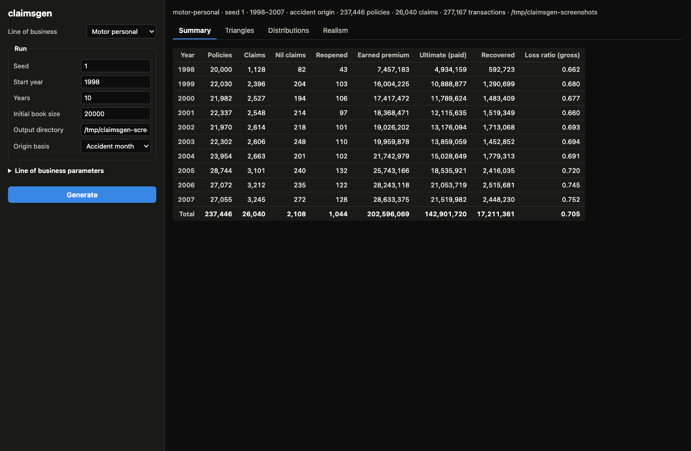
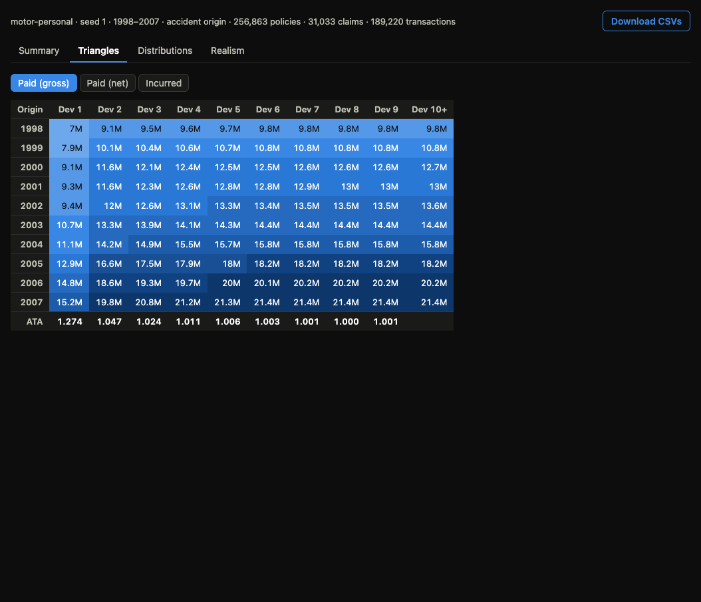
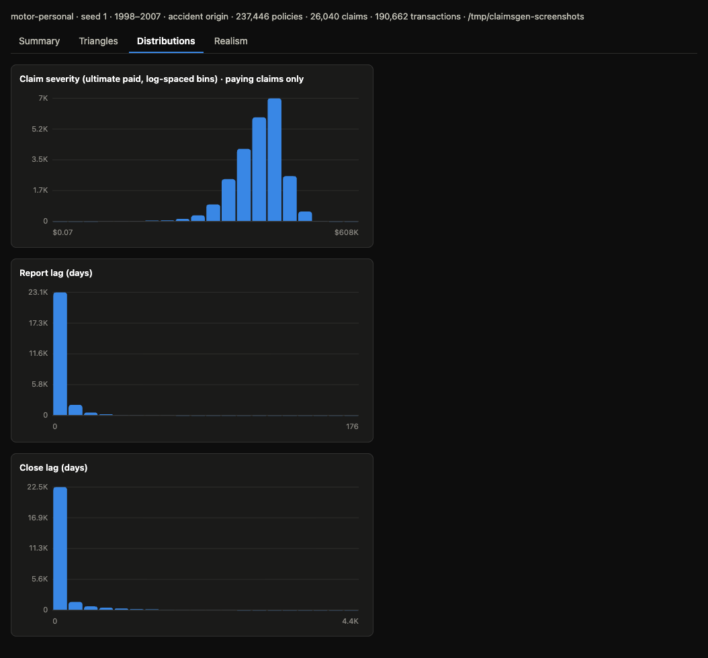
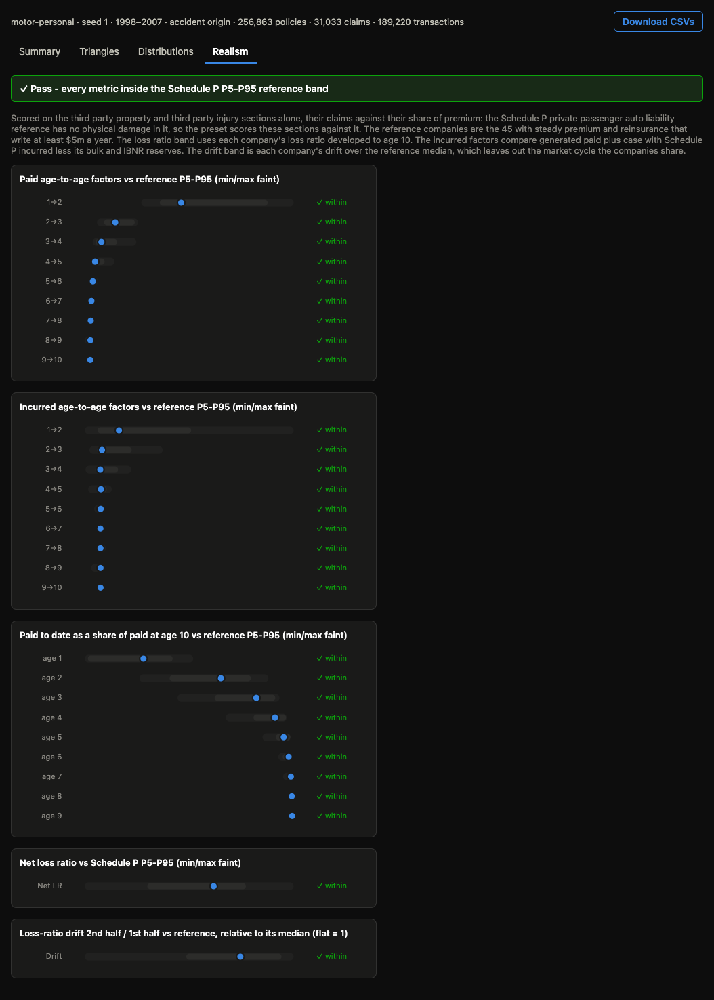
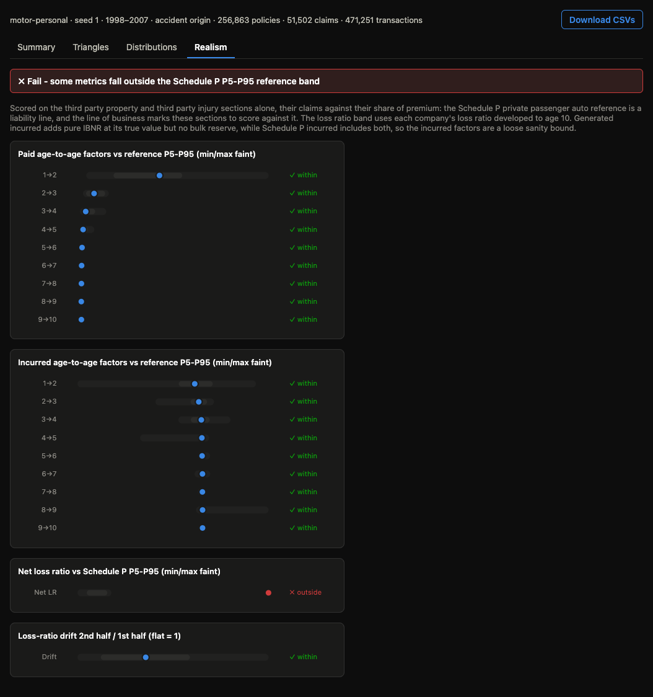

# claimsgen

A local CLI app that generates realistic, fully synthetic insurance claims data as dummy input to reserving processes. Nothing in the output is real, so there are no data governance concerns.

One run produces five linked CSV datasets for a class of business:

- **policies.csv** - the book of policies per calendar year: cover dates, sum insured, excess, risk factor, premium. It includes a warm-up underwriting year before the window, whose policies are in force when it opens
- **claims.csv** - claim events with occurrence, report and close dates plus the initial case estimate
- **transactions.csv** - each claim's case estimate movements, payments, and recoveries (salvage and subrogation) over its lifetime
- **triangles.csv** - incremental monthly development triangles by origin month: paid, paid net of recoveries, incurred, and reported claim counts
- **exposure.csv** - exposure by origin month: premium, exposure units in policy-years, and a policy count that is an in-force count on the accident basis (so it does not sum to the book's policy count) and an inception count on the underwriting basis (so it does, apart from the warm-up year, which incepts before the window)

## Quickstart

```
go build ./cmd/claimsgen
./claimsgen generate
```

That generates a personal motor book (10 calendar years from 1998, 20,000 policies in year one) into `./output/` using the embedded preset. Options:

```
claimsgen generate \
  --config my-lob.yaml \      # line of business parameters (default: embedded motor-personal preset)
  --seed 42 \                 # master random seed (same seed + config = byte-identical output)
  --out ./output \            # output directory
  --start-year 1998 \         # first calendar year of the book
  --years 10 \                # number of calendar years
  --initial-book-size 20000 \ # policies written in the first year
  --origin-basis accident     # monthly origin: accident or underwriting
```

## Browser UI

```
./claimsgen ui
```

Serves a local web UI on `http://127.0.0.1:8080` (`--port` to change). It offers the same run flags as the CLI (including an origin basis select for `--origin-basis`) plus every line of business parameter (prefilled from the preset, editable, including a Pricing group holding the insurer's assumed loss cost and target loss ratio, a Recoveries group for the salvage and subrogation probabilities, mean shares, and lags, and a reopen probability and reopen estimate factor for reopened claims), writes the same five CSVs on Generate, and shows the result: per-year summary stats (including a Recovered column and a Reopened column), paid and incurred development triangles with age-to-age factors and a Paid (gross) / Paid (net) / Incurred toggle, severity and lag distributions, and the run's position inside the Schedule P realism bands. The Schedule P reference data is embedded in the binary.

A run reports its elapsed time and can be cancelled while it is going; the previous run's results stay on screen, dimmed and labelled, until the new ones arrive. Runs are serialized, so two tabs cannot write over each other's CSVs, and the UI caps run size - years, initial book size, and the projected policy count once the growth factor has compounded - so a mistyped parameter is rejected rather than run. The CLI has no such caps.

Configure a run in the sidebar and hit Generate - the summary tab shows per-year stats for the book:



| Development triangles | Distributions |
| --- | --- |
| Cumulative triangles as heatmaps - paid gross, paid net of recoveries, or incurred - with volume-weighted age-to-age factors underneath. | Claim severity (log-spaced bins) plus report and close lag histograms. |
|  |  |

| Realism check | Realism check - failing run |
| --- | --- |
| Every metric of the default preset falls inside the bands observed across the Schedule P reference companies. | Cranking base frequency to 0.5 pushes the ultimate loss ratio outside its band. |
|  |  |

## How the simulation works

1. **Policy book** - each year's book size is the previous year's size times a growth factor times random noise, so the book trends upward but can shrink in individual years. The book starts with a warm-up underwriting year before the window, so the first accident year has a full book in force instead of one ramping up from nothing; only its claims that occur inside the window are kept. Per policy: sum insured (lognormal with calendar-year inflation), a mean-1 risk factor loading claim frequency, an excess from a discrete choice set. Premium is priced from a separate pricing basis - the insurer's assumed loss cost - divided by `target_loss_ratio`, independent of the claims model that generates experience. Each policy's assumed loss cost allows for nil claims and is trended to the middle of its cover. `adequacy_volatility` makes each underwriting year's rates miss the target by a random factor, as in an underwriting cycle. The target sets premium, not experience: the realized loss ratio emerges from the claims model and lands around the target rather than on it, moved by claim sampling, the simulated inflation path, and any gap between the pricing and claims assumptions.
2. **Claim events** - Poisson claim counts per policy scaled by the risk factor; lognormal report lags, short for own damage and longer for third-party injury claims, so there are claims incurred but not yet reported to estimate; ground-up losses mixing own damage (lognormal, scaled by sum insured) and third party liability (Pareto, not capped at sum insured), then scaled by a claims-inflation index at the claim's occurrence date, which rises smoothly through the year; losses below the excess are not reportable. Close delays are gamma distributed: own-damage claims settle in weeks (stretched for claims above a size threshold in start-year dollars, and for risky policyholders), while third-party (liability) claims draw from a slower long-tail regime calibrated to the Schedule P liability reference, so paid losses keep developing at later ages. A share of reported claims are nil - they close without any payment at their first close.
3. **Case estimate runoff** - the severity draw in step 2 is each claim's true ultimate cost, and own damage never pays beyond the sum insured minus excess. The claim opens at a case estimate drawn around that ultimate - `case_adequacy_mean` sets whether cases open deficient or redundant, which moves reserves and incurred development but never the loss cost - payments split the ultimate over the claim's life, and the case estimate is a noisy view of the remaining cost that settles as the claim ages. A nil claim instead carries its case estimate through revisions and releases it to zero at close, paying nothing.
4. **Transactions** - the first row of every claim is its initial case estimate on the report date, so the outstanding case at any time is the running sum of `ESTIMATE` amounts. Every payment carries a matching case reduction. At close the outstanding case is exactly zero and total paid equals the ultimate (zero for a nil claim). Recovery rows are the only transactions dated after a claim's final close date.
5. **Recoveries** - own-damage claims can yield salvage (the wreck is sold) and subrogation (the payout is recovered from an at-fault third party). Each is a Beta-distributed share of the claim's gross paid, received a lognormal lag after the close date - subrogation typically much later than salvage. Recoveries are pure cash events: the case estimate stays gross, and a claim's total recovered is always below its gross paid. Setting a recovery type's probability to 0 switches it off.
6. **Reopened claims** - a closed claim can reopen once: the case is re-raised a lognormal lag after the first close, a second episode develops and pays an additional amount, and the claim closes for good. The reopen's additional cost is a configurable factor of the claim's ultimate, capped for own damage at the cover the claim has left (a total loss paid up to its sum insured does not reopen), and a nil claim that reopens pays in its second episode. claims.csv shows the final close date; the reopen is visible in transactions as the case re-raised after a release to zero. Setting the reopen probability to 0 switches reopening off.

Gross paid is the sum of a claim's `PAYMENT` rows; net paid subtracts its `SALVAGE` and `SUBROGATION` rows.

transactions.csv is emitted in claim-registration order, not date order: all of a claim's rows are written together, and because recovery rows can post-date a claim's close date, a later claim's rows can carry earlier dates. Sort by date yourself if your reserving tool expects a date-ordered ledger.

Claims inflation is a stochastic path: each calendar year's factor is a mean level (a per-line-of-business knob) times lognormal noise, compounding from the start year and drawn from its own labelled sub-stream so it stays reproducible and independent of the other stages.

Every independent decision is drawn from its own labelled sub-stream keyed by the seed and a label path, so toggling a knob is invisible to unrelated draws: turning nil claims, reopening, salvage, or subrogation on or off never reshuffles the dates or severities of any other claim or stage. (Salvage and subrogation amounts remain linked through the rule that a claim's total recovered stays below its gross paid, which is an accounting constraint, not a random draw.)

There is no valuation date: every claim runs to closure, which supports out-of-sample testing of reserving methods.

### Monthly triangles and exposure

`triangles.csv` is one row per (origin month, development month) cell:

```
origin_month,dev_month,paid,paid_net,incurred,reported_count
```

Cells are **incremental**, not cumulative - the movement in that development
month - so they aggregate up by simple addition: sum cells into quarters or
years, or take a running sum along a row for the cumulative triangle. Development
months are numbered from 1, where 1 is the origin month itself, and run to full
runoff, so the file includes development after the run window ends. For a
valuation-date view, keep only the rows where `origin_month + dev_month - 1` is
at or before the valuation month. Every cell is written, zeros included, so the
grid's extent is explicit.

`paid` is gross of recoveries, `paid_net` subtracts salvage and subrogation, and
`incurred` is gross case plus net paid. `reported_count` counts claims in the
development month they were **reported**, not the month they occurred.

`exposure.csv` is one row per origin month on the same axis:

```
origin_month,premium,exposure_units,policies
```

`--origin-basis accident` (the default) keys a claim on the month it occurred and
reports exposure earned in each month, day pro-rata. `--origin-basis
underwriting` keys a claim on its policy's inception month and reports exposure
written in that month, so a policy's whole premium and whole term land at
inception. The basis governs these two files only: the annual triangles and the
realism check stay on the accident basis, because the Schedule P reference data
is an accident-year presentation.

On the underwriting basis, exposure is written in full at inception while the
claim occurrences scored against it stop at the run window's end, so the final
twelve origin months carry a full policy-year of premium against a fraction of
a policy-year of claims and read as immature by construction. The accident
basis does not have this asymmetry: exposure and claims are both truncated the
same way at the end of the window.

## Parameters per line of business

All behavior is driven by a YAML file mapped to the `LineOfBusiness` domain object - see `internal/infrastructure/config/motor-personal.yaml` for the annotated motor preset. The top-level blocks are `book`, `pricing`, `claims`, and `runoff` - `pricing` holds the insurer's assumed loss cost, kept separate from the `claims` block that generates the true experience. A new short-tail class is a YAML file for the CLI (`generate --config my-lob.yaml` is pure YAML, no code changes); surfacing it as a UI preset also needs one registration line in the preset registry. See `docs/roadmap.md` for the second-line-of-business plan.

## Assumptions and known simplifications

The model deliberately trades some realism for a clean, reproducible engine. The main simplifications a reviewer should know about:

- **Own-damage severity trends at the claims index only and is capped at the sum insured.** Own-damage losses are sized off a fixed base-year sum insured, trended by the claims-inflation index at the occurrence date alone, and capped at the policy's sum insured - so own damage and third party share the single claims-inflation trend and own damage can never exceed the cover. Third-party losses carry the same claims-inflation index and are not capped at the sum insured.
- **Case estimates re-centre on the true ultimate at the first revision**, so incurred development carries little systematic IBNER signal - incurred is close to unbiased at every age, and incurred-based methods will look flattering on this data.
- **Nil claims draw severity and probability independently of claim size**; real withdrawn or nil claims skew small.
- **Large own-damage claims settle slower in one step.** An own-damage claim above `size_threshold` (in start-year dollars) has `size_multiplier` times the mean close lag, so settlement time jumps at the threshold rather than rising smoothly with size.
- **No seasonality, catastrophe, or event clustering.** Occurrences are uniform within each cover period and claims are independent across policies (the only cross-policy link is the shared inflation path).
- **Each year's book is an independent cohort** - no policy renews, so per-policy claim histories never correlate across years.
- **The preset's pricing assumptions start from the claims parameters.** The shipped `pricing` block uses the same values as the `claims` block, so the book carries no systematic mispricing and its loss ratio lands around `target_loss_ratio`: across seeds 1-40 it fell between 0.94 and 1.08 times the target, mostly from the simulated inflation path. A small `adequacy_volatility` (0.03) scatters each underwriting year's pricing around the target. Real cycles are larger and persist across years, which this independent per-year noise does not model. Set the `pricing` block away from the claims values to model underpricing, overpricing, or adverse experience. One small built-in gap: the reopen uplift ignores the cap that holds an own-damage reopen within the cover left, so claims near their limit are slightly overpriced.

## Realism

Generated data is checked against 96 hand-curated Schedule P private passenger
auto reference companies (`data/reference/schedule p/ppauto_pos98-07/`,
accident years 1998-2007). That reference is Schedule P's private passenger
auto *liability* line, with no physical damage in it, so the check scores the
third-party (liability) section alone: third-party claims against the
third-party share of premium. Own-damage claims are left out of the score
rather than slowed to liability settlement speed, and the preset sets their
settlement as a short-tail class. The UI's triangle tab still shows the whole
book. The companies were curated from the full Schedule P
extract via `data/reference/gr-code-list.md` and `tools/prune-dec2025.ps1` to
remove low-volume and degenerate companies. Paid and incurred age-to-age
development factors, the ultimate loss ratio, and the loss-ratio drift between
the two halves of the accident years must fall inside the P5-P95 bands
observed across those companies. The generated triangles run to full
development, so the loss ratio is scored against each company's loss ratio
developed to age 10 with its later reported development, not its latest
diagonal. Schedule P incurred includes bulk and IBNR reserves, so the
generated incurred the check scores adds pure IBNR, the true cost of claims
that have occurred but are not yet reported. It has no bulk reserve, though,
and a perfect IBNR does not over-reserve and release the way a real company's
estimate does, so treat the incurred check as a loose sanity bound. A
backstop filter drops any company carrying no scorable signal, and the full
min/max range is shown for context. The paid comparison is net of recoveries, matching how Schedule P
reports paid losses. This runs as a test gate (`TestDefaultPresetIsRealistic`,
across several seeds). Real books drift widely, so the drift band is loose; a
separate test (`TestPresetHasNoSystematicLossRatioDrift`) switches the model's
inflation and pricing noise off and requires the loss ratio to stay flat, which
catches systematic drift such as pricing and claims inflation trending apart.

## Development

```
go test ./...
go vet ./...
```

Screenshots are regenerated with `tools/screenshots` (start the UI on port 8093, `npm install`, `node screenshots.js`).

The layout is domain-driven: `internal/domain/` holds the simulation model (policy, claim, transaction, lob, triangle) with no outside dependencies, `internal/application/` the use cases, and `internal/infrastructure/` the adapters (config, CSV, Schedule P reader, gonum-backed randomness). Design docs live in `docs/`.
